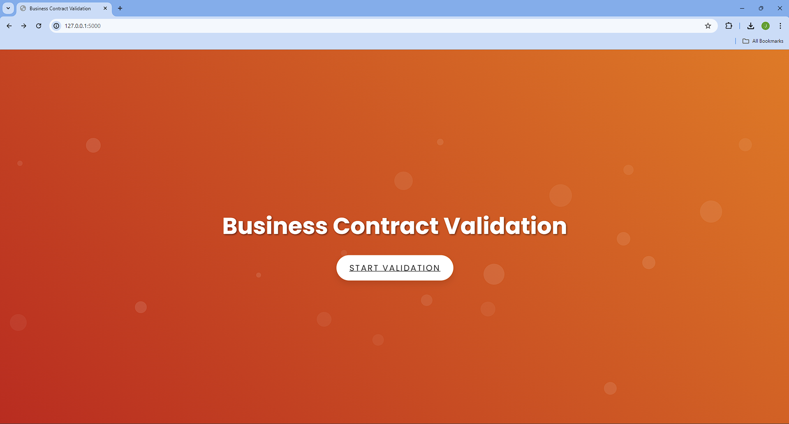
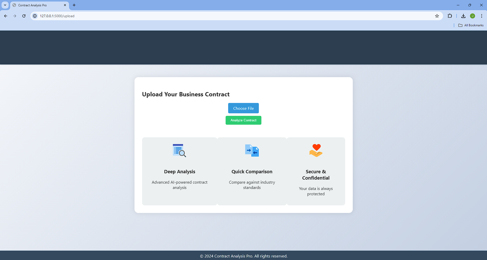
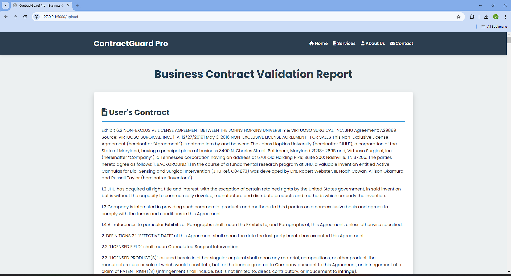
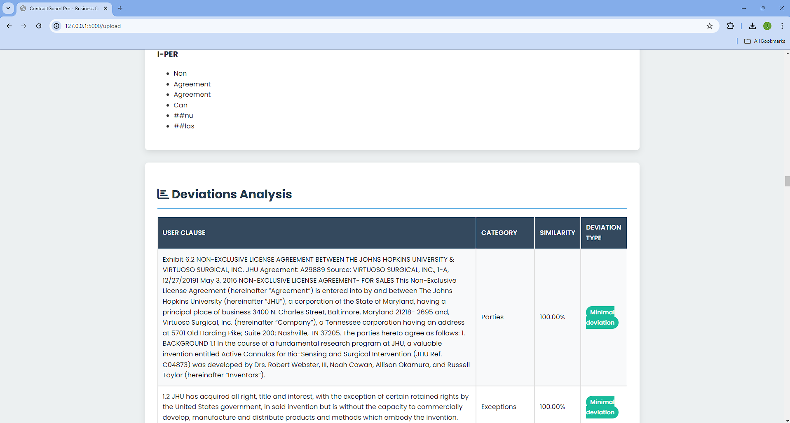
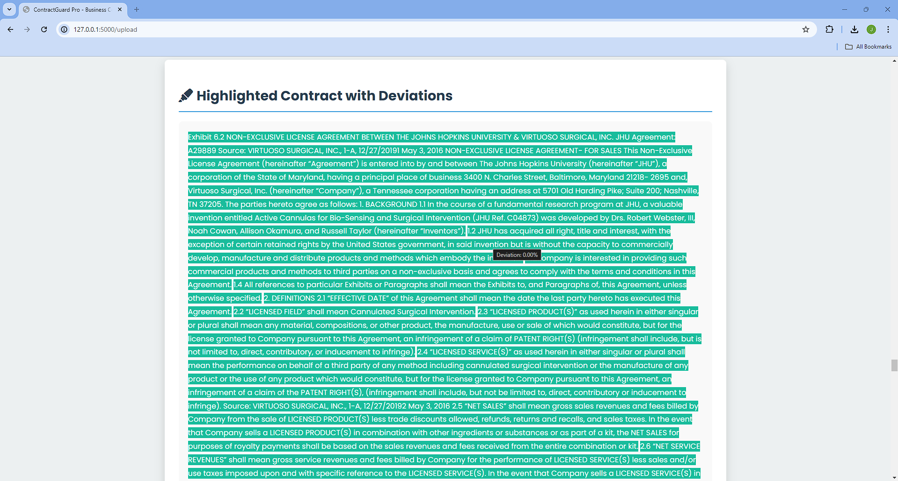
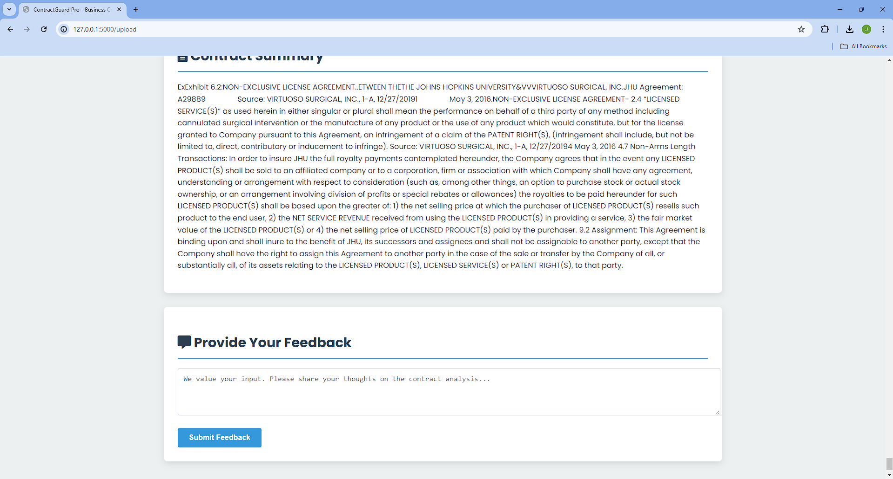
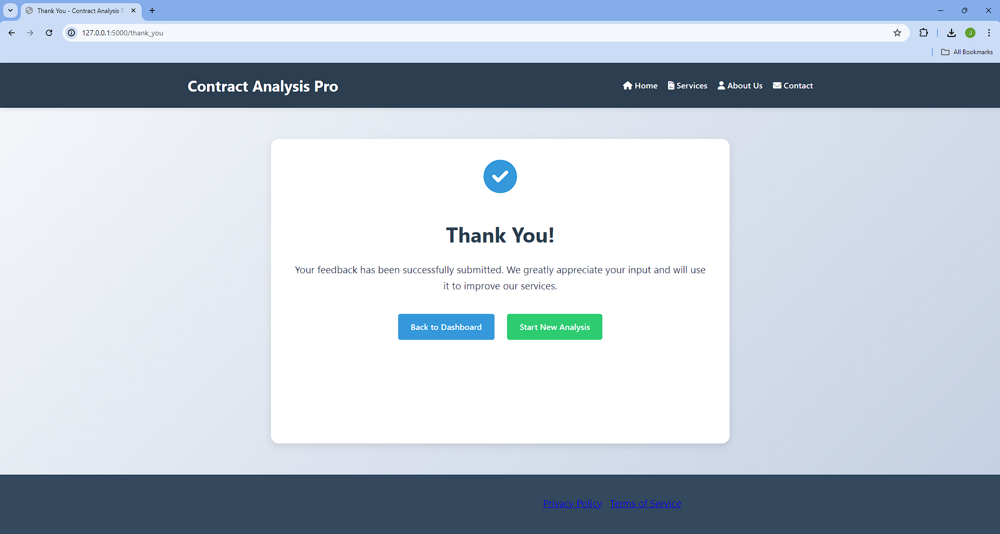

# Business-Contract-Validation
Intel Unnathi Project .
Our Business Contract Validation System is designed to enhance the efficiency and accuracy of contract analysis. The system employs sophisticated machine learning algorithms to classify various contract clauses and detect deviations from standard templates. By comparing a user-provided contract with the most relevant template from a repository of 357 business contract templates, our system highlights any anomalies or deviations, thereby ensuring that contracts adhere to predefined standards and mitigating potential risk.

Contract Analysis Pro is a sophisticated web application designed to analyze and validate business contracts using advanced AI and natural language processing techniques.

## Features

- Deep analysis of contracts using AI-powered algorithms
- Quick comparison against industry standards
- Secure and confidential data handling
- Named Entity Recognition (NER)
- Deviation analysis from standard templates
- Contract summarization
- User-friendly interface with animated elements

## Dataset
Contract Analysis Pro uses a comprehensive dataset to provide accurate and relevant contract analysis:
- The system compares user contracts against [665 business contract templates](https://drive.google.com/drive/folders/1K9iD6_At3-K8S1EGjITh44pvqpY2pzvb?usp=drive_link), covering various business standards and purposes.
- Our machine learning models are trained on a balanced dataset ([balanced_dataset2.csv](https://drive.google.com/file/d/18ZBTEvtNX3KUe26xw3u2IsN-zGQstdKq/view?usp=drive_link)) containing 108,765 clauses, each categorized into specific types.
- This extensive dataset ensures that our analysis covers a wide range of contract types and clauses, providing robust and reliable results.
- Other models used in this project can be found [here](https://drive.google.com/drive/folders/1Lg-tuYJu3xTU3Nnlz2_lc5RzPb4a_dSC?usp=drive_link).

## How to Use

### 1. Front Page
When you first access the application, you'll see the Business Contract Validation front page.
- Click the "Start Validation" button to begin the contract analysis process.

### 2. Upload Page
On the upload page, you can submit your contract for analysis.
- Click on the "Choose File" button to select your contract file (PDF or DOCX format).
- After selecting the file, click the "Upload" button to submit your contract for processing.
- The system will analyze your contract and redirect you to the results page.

### 3. Results Page
The results page displays a comprehensive analysis of your uploaded contract.
- View the full text of your uploaded contract.
- See a list of Named Entities extracted from the contract, grouped by entity type.
- Review the Deviations Analysis, which shows:
  - User clauses
  - Categories
  - Similarity scores
  - Deviation types (with color-coded tags)
- Examine the Highlighted Contract with Deviations, where deviations are visually emphasized.
- Read a concise Contract Summary.
- Provide feedback using the feedback form at the bottom of the page.

### 4. Thank You Page
After submitting feedback, you'll be redirected to a thank you page.
- This page confirms that your feedback has been received.
- You can choose to go back to the Dashboard or start a new analysis from here.

## Buttons and Functions

- **Start Validation**: Initiates the contract upload and analysis process.
- **Choose File**: Allows you to select a contract file from your device.
- **Upload**: Submits the selected file for analysis.
- **Submit Feedback**: Sends your feedback about the analysis to the system administrators.
- **Back to Dashboard**: Returns you to the main dashboard (from the Thank You page).
- **Start New Analysis**: Begins a new contract analysis process (from the Thank You page).

## Security and Privacy

Contract Analysis Pro prioritizes the security and confidentiality of your data. All uploaded contracts and analyses are processed securely.

## About Us
Made by - Jobinjoy Ponnappal
        - Kavya Raj P
        - Aleena Thomas
        - Mohammed Amaan

